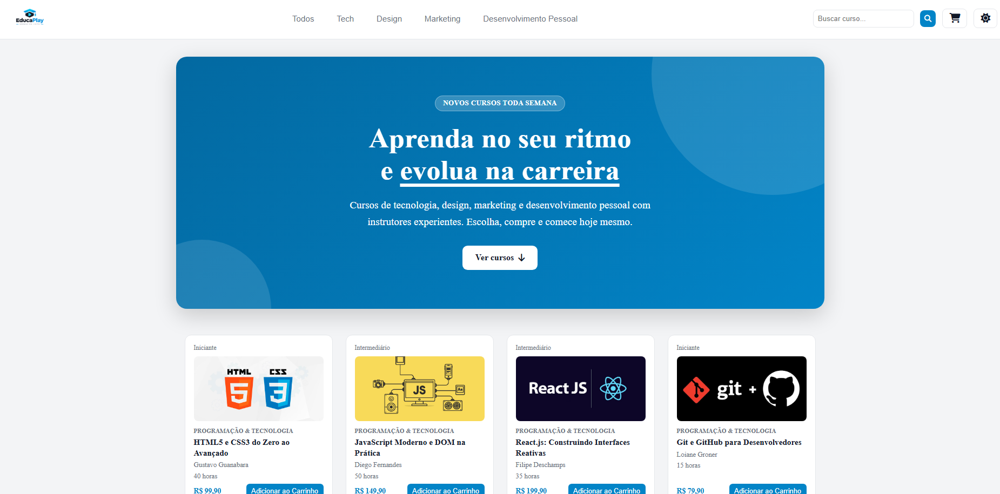
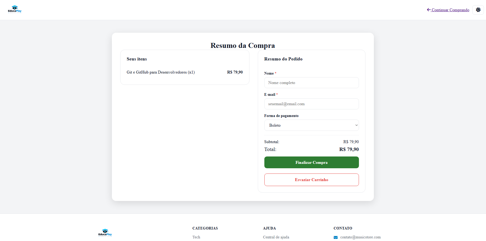

# EducaPlay

Loja virtual de cursos online desenvolvida com HTML, CSS e JavaScript puro. O usuário navega por um catálogo de cursos, filtra por categoria, busca por texto, monta um carrinho e finaliza a compra em uma página de checkout. O projeto é totalmente responsivo e conta com tema claro e escuro.

> Projeto front-end, sem back-end. Os dados dos cursos ficam em um arquivo JavaScript e o carrinho é salvo no navegador.

## Demonstração

- **Site:** `https://cursos-educa-play.vercel.app`

| Home                           | Checkout                               |
| ------------------------------ | -------------------------------------- |
|  |  |

## Funcionalidades

**Catálogo**

- 20 cursos distribuídos em 4 categorias: Programação & Tecnologia, Design & UX/UI, Marketing & Negócios e Produtividade & Soft Skills
- Cada card exibe nível, categoria, título, instrutor, duração e preço
- Filtro por categoria pelos botões da navegação
- Busca por título, instrutor ou categoria, atualizada enquanto o usuário digita
- Mensagem quando nenhum curso é encontrado
- Rolagem suave do botão da hero até a lista de cursos

**Carrinho**

- Modal de carrinho aberto pelo ícone na navegação
- Adicionar cursos, aumentar ou diminuir a quantidade e remover itens
- Contador de itens no ícone do carrinho
- Total calculado automaticamente
- Persistência com `localStorage`: o carrinho continua salvo ao recarregar a página ou navegar entre as páginas

**Checkout**

- Lista dos itens com quantidade e subtotal
- Formulário com nome, e-mail e forma de pagamento (boleto, cartão de crédito, cartão de débito ou Pix)
- Validação dos campos obrigatórios pelo próprio HTML
- Botão para esvaziar o carrinho, com confirmação
- Botões desabilitados quando o carrinho está vazio, com link para voltar à loja
- Finalização simulada: exibe uma mensagem de agradecimento, limpa o carrinho e retorna à home

**Interface**

- Tema claro e escuro, controlado por variáveis CSS
- Layout responsivo com menu hambúrguer no celular e tablet
- Footer com links, redes sociais, contato e formas de pagamento
- Rótulos `aria-*` nos botões de ícone e estados de foco visíveis, pensando em acessibilidade
- Respeito à preferência de menos movimento (`prefers-reduced-motion`)

## Tecnologias

- **HTML5** semântico
- **CSS3**: variáveis customizadas, Grid, Flexbox, `clamp()`, media queries e pseudo-elementos
- **JavaScript (ES6+)**: manipulação do DOM, `localStorage`, `Array.prototype.filter`, `reduce` e `find`
- **[Plus Jakarta Sans](https://fonts.google.com/specimen/Plus+Jakarta+Sans)** & **[Inter](https://fonts.google.com/specimen/Inter)** via Google Fonts (Tipografia)

## Estrutura do projeto

```
.
├── index.html
├── checkout.html
├── css/
│   ├── style.css
│   └── responsive.css
├── js/
│   ├── products.js
│   ├── main.js
│   ├── cart.js
│   └── theme-toggle.js
└── assets/
    └── img/
        ├── logo.jpg
        └── (imagens dos cursos)
```

| Arquivo           | Responsabilidade                                                                                     |
| ----------------- | ---------------------------------------------------------------------------------------------------- |
| `products.js`     | Lista com os 20 cursos (id, título, categoria, preço, nível, duração, instrutor, imagem e descrição) |
| `main.js`         | Renderização dos cards, filtro por categoria, busca e menu hambúrguer da home                        |
| `cart.js`         | Estado do carrinho, `localStorage`, modal do carrinho e página de checkout                           |
| `theme-toggle.js` | Alternância entre tema claro e escuro                                                                |
| `style.css`       | Estilos base, componentes e layout para desktop                                                      |
| `responsive.css`  | Ajustes para tablet e celular (carregado depois do `style.css`)                                      |

## Como executar

Não é preciso instalar dependências.

1. Clone o repositório:
   ```bash
   git clone https://github.com/seu-usuario/nome-do-repositorio.git
   ```
2. Entre na pasta do projeto:
   ```bash
   cd nome-do-repositorio
   ```
3. Abra o projeto com um servidor local. A forma mais simples é a extensão **Live Server** do VS Code: clique com o botão direito em `index.html` e escolha **Open with Live Server**.

> Use um servidor local em vez de abrir o arquivo direto no navegador. Os caminhos das imagens dos cursos são relativos à raiz do site.

## Responsividade

O CSS segue a abordagem _desktop-first_ e usa os seguintes pontos de quebra:

| Largura    | O que muda                                                                                      |
| ---------- | ----------------------------------------------------------------------------------------------- |
| até 1024px | Grid de cursos mais compacto, footer em 3 colunas                                               |
| até 768px  | Menu hambúrguer, checkout em uma coluna, footer em 2 colunas                                    |
| até 480px  | Um curso por linha, botões em largura total, modal do carrinho adaptado, footer em coluna única |
| até 360px  | Espaçamentos reduzidos para telas muito pequenas                                                |

## Como adicionar um curso

Adicione um novo objeto ao array em `js/products.js`, usando um `id` único:

```javascript
{
  id: 21,
  title: "Nome do curso",
  category: "Programação & Tecnologia",
  price: 99.9,
  level: "Iniciante",
  duration: "20 horas",
  instructor: "Nome do instrutor",
  image: "/assets/img/nome-da-imagem.jpg",
  description: "Breve descrição do curso."
}
```

O valor de `category` precisa ser igual ao `data-category` de um dos botões da navegação em `index.html` para o filtro funcionar.

## Possíveis melhorias

- Integração com um back-end e gateway de pagamento reais
- Página de detalhes de cada curso
- Paginação ou carregamento sob demanda da lista de cursos
- Cupom de desconto no checkout
- Máscaras e validações mais completas nos campos do formulário

## Autor

**Jonathan Laureano Lima**

- GitHub: [@mrjonc](https://github.com/mrjonc)
- LinkedIn: [Jonathan Laureano Lima](https://www.linkedin.com/in/jonathan-laureano-lima/)
- Portfólio: (https://jonathan-laureano-lima.vercel.app)

## Licença

Este projeto foi desenvolvido para fins de estudo.
